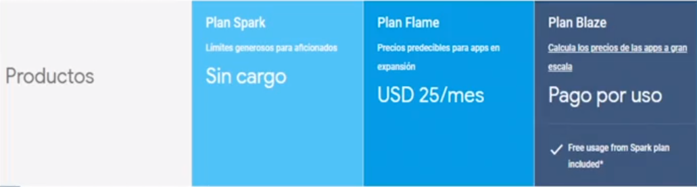
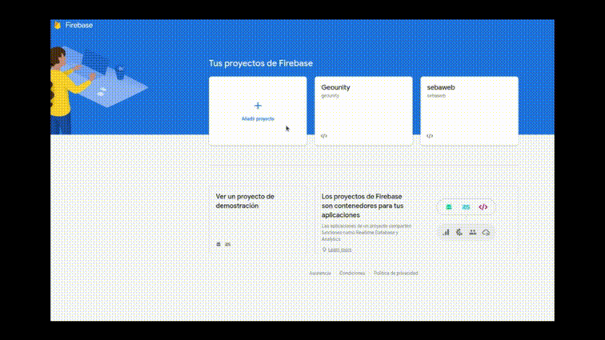
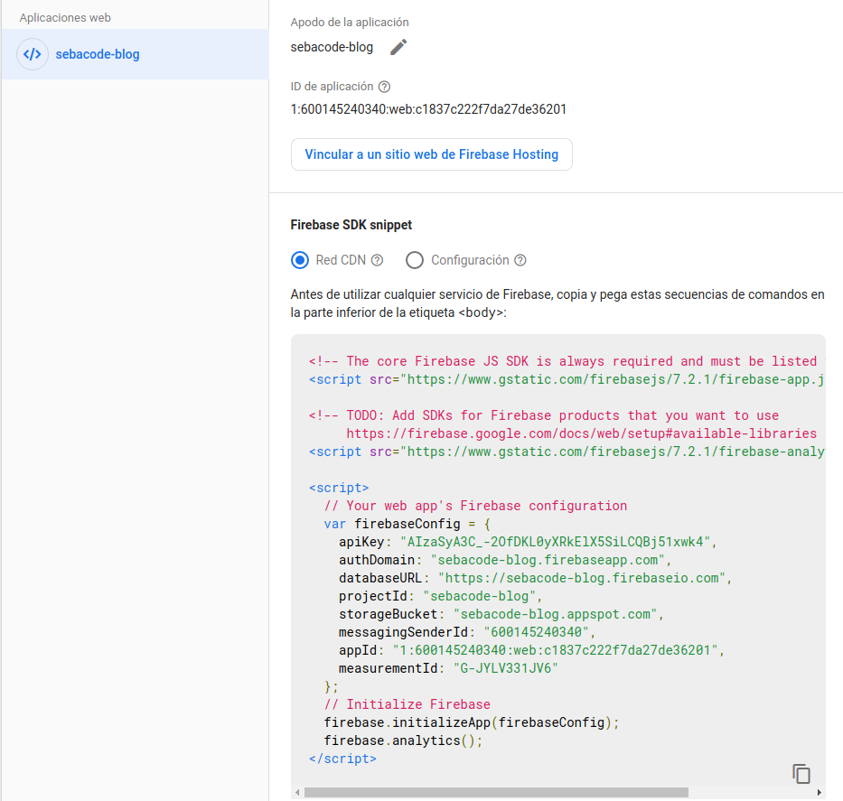

> Firebase esta soportado bajo Google Cloud Platform (GCP)

### Servicios de Firebase para la Web

- **Autentiación:** - Autentica usuarios de manera simple, rápida y segura con email y contraseña, redes sociales o mensajes de texto.
- **Cloud Storage:** - Almacenar y leer archivos estáticos como imágenes, videos u otros.
- **Cloud Firestore:** - Funciona como una base de datos NoSQL. Almacena y sincroniza lo datos de nustra aplicación en tiempo real.
- **Cloud Messaging:** Envio de mensajes y notificaciones segmentadas.
- **Cloud Functions:** - Nos van a permitir almacenar la lógica de nuestro negocio. Se puede usar para desplegar nuestras aplicaciones.
- **Hosting:** - Nos permite almacenar nuestro sitio web.
- **Integraciones:** - Podemos conectar las funciones de Firebase con otros servicios como: _Google Ads_, _Google Marketing Platform_, _PlayStore_, _Slack_, _etc_.

### ¿Cuánto dinero me cuesta Firebase?

La verdad es que puedes comenzar a utilizar Firebase de manera gratuita. No hay tiempo límite, solo hay recursos limitados. Si recién estas comenzando puedes optar por la opcion gratuita y mas adelante si tu aplicación lo necesita actualizar el plan.



### Registrarse en Firebase y comenzar un proyecto

Para comenzar nos registramos en [firebase](https://firebase.google.com/) con nuestra cuenta de gmail o cualquier otro correo. Nos va a mostrar una bienvenidas explicando todos los servicios que nos ofrecen. Luego añadimos un nuevo proyecto con un nombre único. Si ya existe nos dará un nombre sugerido o lo cambiamos hasta que este disponible. También podremos configurar Google Analytics de forma muy fácil como muestro en el siguiente gif:



A continuación le decimos si lo vamos a usar para la Web, en Android o iOS. En mi caso voy a crear una aplicación web. Me da un código de configuración para pegar en mi proyecto.



Recomiendo que naveguen por las distintas secciones y pestañas para que se vayan familiarizando con las maravillas que nos brinda firebase. Ya tenemos nuestro proyecto listo en Firebase ahora pasemos a crear la aplicación con Nuxt para empezar a usar los servicios.

```js
npx create-nuxt-app sebacode-blog
```

Nos hara algunas preguntas acerca de como queremos configurar nuestro proyecto.